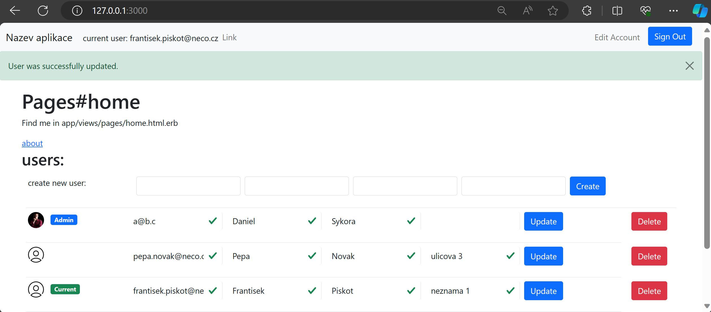

# README

je implementovana manipulace s usery i jejich login a registrace
je mozno pridavat, mazat a editovat usery (pri pridani noveho usera pres view users se nastavi heslo na 'password', jinak pri registraci si heslo nastavuje uzivatel)
momentalne neni implementovana jakakoli bezpecnost (pridavat a mazat usery muze kdokoli)
avatari jsou ulozeni tak ze k nim ma take pristup kdokoli (nevim jestli je to tak spravne)

